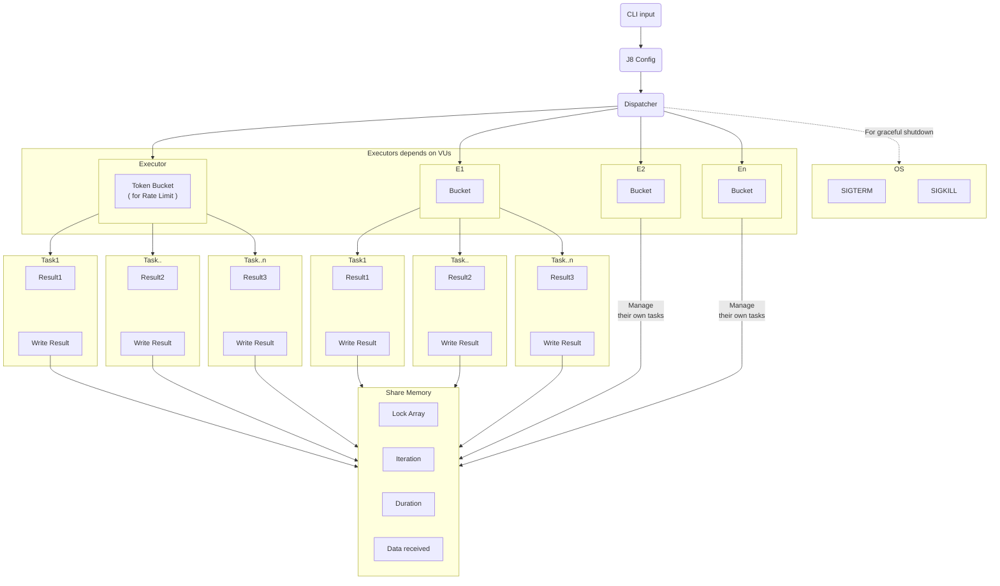
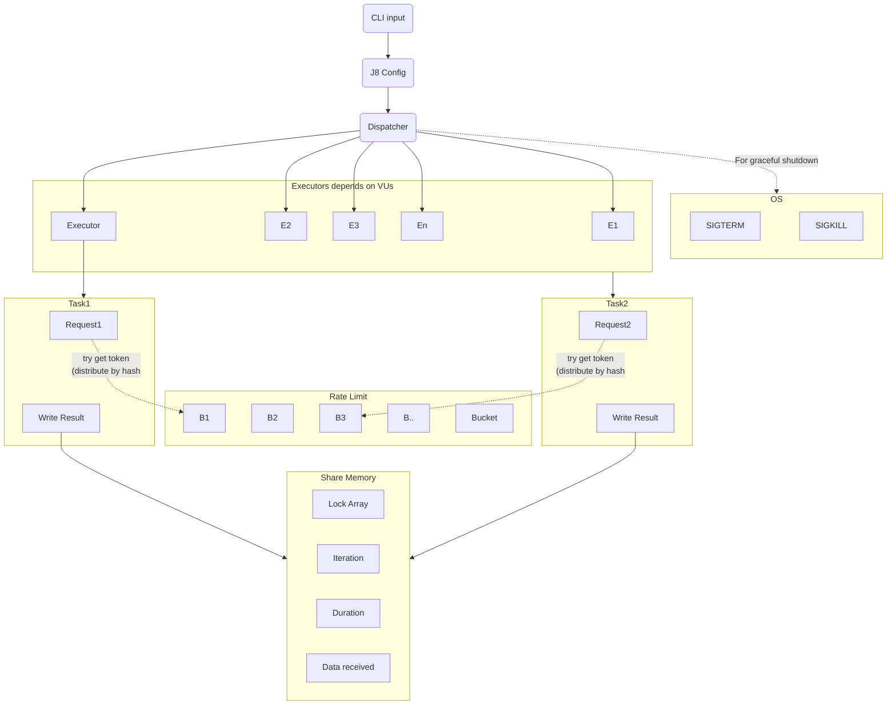
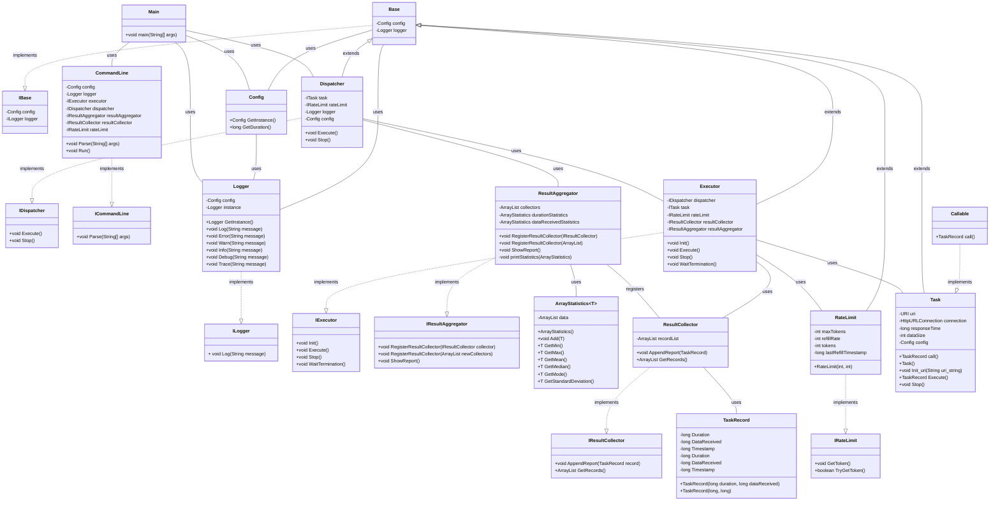

# Japybara (J8) CLI

> [!Note]
> A load testing CLI similar to [`k6`](https://k6.io/) but written in Java.  
> (We like **Kapybara** and we are using Java, so we named it **Japybara**, and briefly **J8** CLI.)

* [Japybara (J8) CLI](#japybara-j8-cli)
    * [Project Structure](#project-structure)
        * [Latest Structure](#latest-structure)
        * [Original Structure](#original-structure)
    * [UML Diagram](#uml-diagram)

## Project Structure

### Latest Structure

### Original Structure

## UML Diagram

